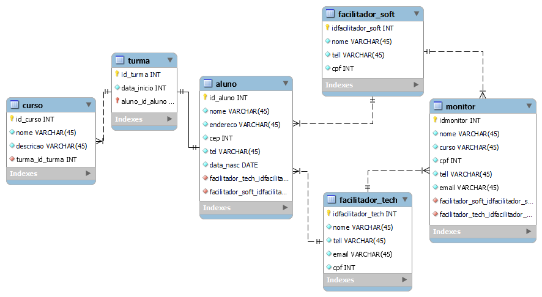

[](https://git.io/typing-svg)

Projeto Individual do Módulo 4 do Curso Programadores Carioca - SENAC/Resilia
    
    
    
<h2>Sobre o projeto:</h2>
Existem outras entidades além dessas três?

```sh
Sim, considerando o modelo e sistema da instituição de ensino, além das entidades que foram solicitadas (curso, turmas e alunos), foi necessário adicionar mais 4 entidades, sendo elas:
1. Facilitador Soft
2. Facilitador Hard
3. Monitor
4. Matrícula
```

Quais são os principais campos e tipos?

```sh
Os principais campos são os ID de cada entidade (as chaves primárias). A maioria dos campos são INT. 
```

Como essas entidades estão relacionadas?

```sh
Dentro da modelagem desenvolvida, temos relacionamentos que são binários e ternários. Por exemplo, o relacionamento Cursos-Turmas é um conjunto de relacionamentos binários, ou seja, ele envolve dois conjuntos de entidades. 
A maioria dos conjuntos de relacionamentos neste sistema de banco de dados é binária. Porém, existem conjuntos de relacionamentos que envolvem mais de dois conjuntos de entidades, como o relacionamento entre Turmas-Matrícula-Alunos. 


 
